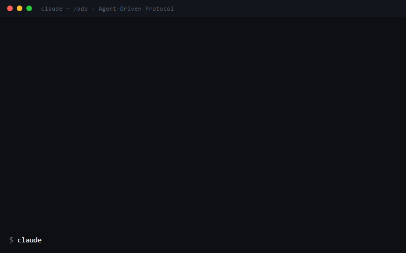

<div align="center">


# ADP · Fase Zero

**Seu Claude Code, vira Tech Lead.**

A Fase Zero do **Agent-Driven Protocol**: a IA te entrevista até o escopo ficar
redondo e transforma a conversa num PRD de verdade — **antes de qualquer linha de código.**

[](LICENSE)
[](https://claudespecdriven.com.br)
[](https://claudespecdriven.com.br)

</div>

---

## O problema

O jeito clássico de usar IA pra codar: prompt gigante → a IA sai codando → você
descobre no final que ela resolveu o problema errado. Retrabalho + token queimado.

**O problema não é o modelo. É não ter método.**

## O que a Fase Zero faz

Duas skills + um arquivo de convenções, direto no seu Claude Code:

| | Skill | O que faz |
|---|---|---|
| **Fase 0** | `grill-me` | Inverte a entrevista: a IA te pergunta — uma pergunta por vez, sem aceitar resposta vaga — até escopo e critérios de sucesso ficarem claros. |
| **Fase 1** | `to-prd` | A conversa vira um PRD de verdade: user stories, critérios de aceitação e os seams do sistema. |
| — | `CLAUDE.coringa.md` | Índice + convenções pra adaptar o método ao seu projeto e stack. |

Nada vira código sem você ter visto o plano.

## Instalação (2 minutos)

No Claude Code:

```
/plugin marketplace add murilomn58/Claude-Spec-Driven-Fase-Zero
/plugin install adp-fase-zero@adp
```

Pronto. Comece uma feature com a skill `grill-me` ("vamos começar essa feature",
"levanta os requisitos", "grill") e deixe a entrevista acontecer.

<details>
<summary>Alternativa: instalação manual (sem plugin)</summary>

1. Clone ou baixe este repositório.
2. Copie `skills/grill-me` e `skills/to-prd` para a pasta `.claude/skills/` do seu projeto.
3. Mescle o `CLAUDE.coringa.md` no `CLAUDE.md` do seu projeto, adaptando as convenções ao seu stack.

</details>

## E o resto do protocolo?

A Fase Zero é o começo. O **Protocolo Completo** roda o ciclo inteiro com um
único comando — `/adp <projeto> "<feature>"` — parando em **4 gates de
aprovação humana**:

<div align="center">

</div>

| Fase | O que acontece |
|---|---|
| 0 · `grill-me` | A IA te entrevista até o escopo ficar redondo · **🚧 gate: você aprova o escopo** |
| 1 · `to-prd` | A conversa vira PRD · **🚧 gate: você aprova o PRD** |
| 2 · `to-issues` | O PRD vira vertical slices na ordem certa · **🚧 gate: você aprova as issues** |
| 3 · `tech-lead` | Cada fatia sai em TDD, um subagente por issue |
| 4 · `qa` | Testes verdes + a tela aberta no navegador como prova |
| 5 · `guardrails-pr` | Hook barra segredos no commit e abre o PR · **🚧 gate: você revisa o merge** |

E a cada feature entregue, o protocolo redesenha um **mapa vivo da arquitetura**
(`/adp-map`) — o diagrama que não morre no Miro.

Efeito colateral: como as skills carregam o raciocínio, dá pra rodar Sonnet em
esforço médio no lugar de Opus em esforço alto com resultado comparável — nas
minhas estimativas, **até 70% menos tokens por feature** (cenário estimado).

**→ [Protocolo Completo em claudespecdriven.com.br](https://claudespecdriven.com.br)** — R$47 no lançamento, 7 dias de garantia.

---

## English

**ADP · Fase Zero** is the free first phase of the Agent-Driven Protocol, a
spec-driven method for Claude Code built for Brazilian devs first — **the
content is in Portuguese (PT-BR)**. The methodology isn't language-bound:
Claude follows PT-BR skills fine while responding in your language.

Two skills: `grill-me` (the AI interviews *you* until scope is airtight) and
`to-prd` (the conversation becomes a real PRD) — nothing becomes code before a
human sees the plan. The [full protocol](https://claudespecdriven.com.br) runs
six phases with four human approval gates, TDD enforcement, a living
architecture map and a secrets-blocking hook.

Install: `/plugin marketplace add murilomn58/Claude-Spec-Driven-Fase-Zero` →
`/plugin install adp-fase-zero@adp`.

---

<div align="center">

Feito por [Murilo Narciso](https://github.com/murilomn58) · [claudespecdriven.com.br](https://claudespecdriven.com.br)

</div>
